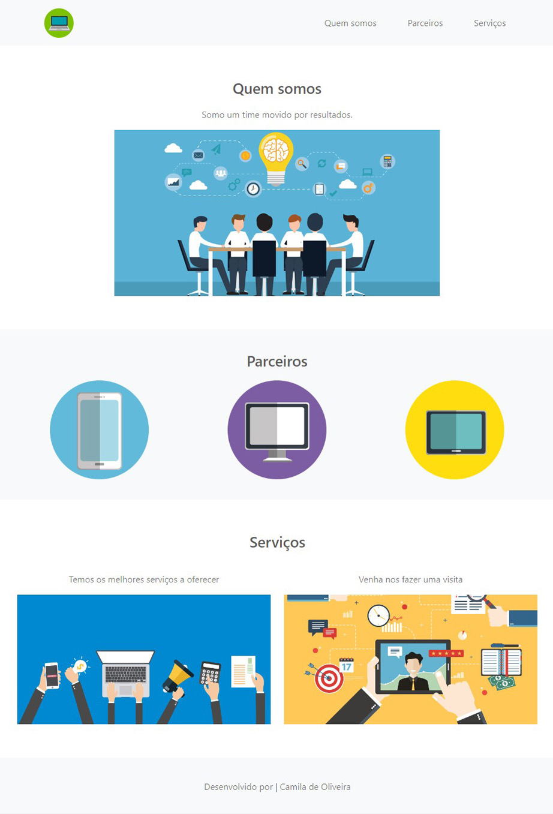

# Aula_bootstrap_DIO
Desenvolvimento de página institucional, utilizando conhecimentos adquiridos na aula Bootstrap - DIO

## Tecnicas e ferramentas utilizadas
- ``HTML``
- ``CSS``
- ``Bootstrap``
- ``Adobe Photoshop``
- ``VS Code IDEA``
